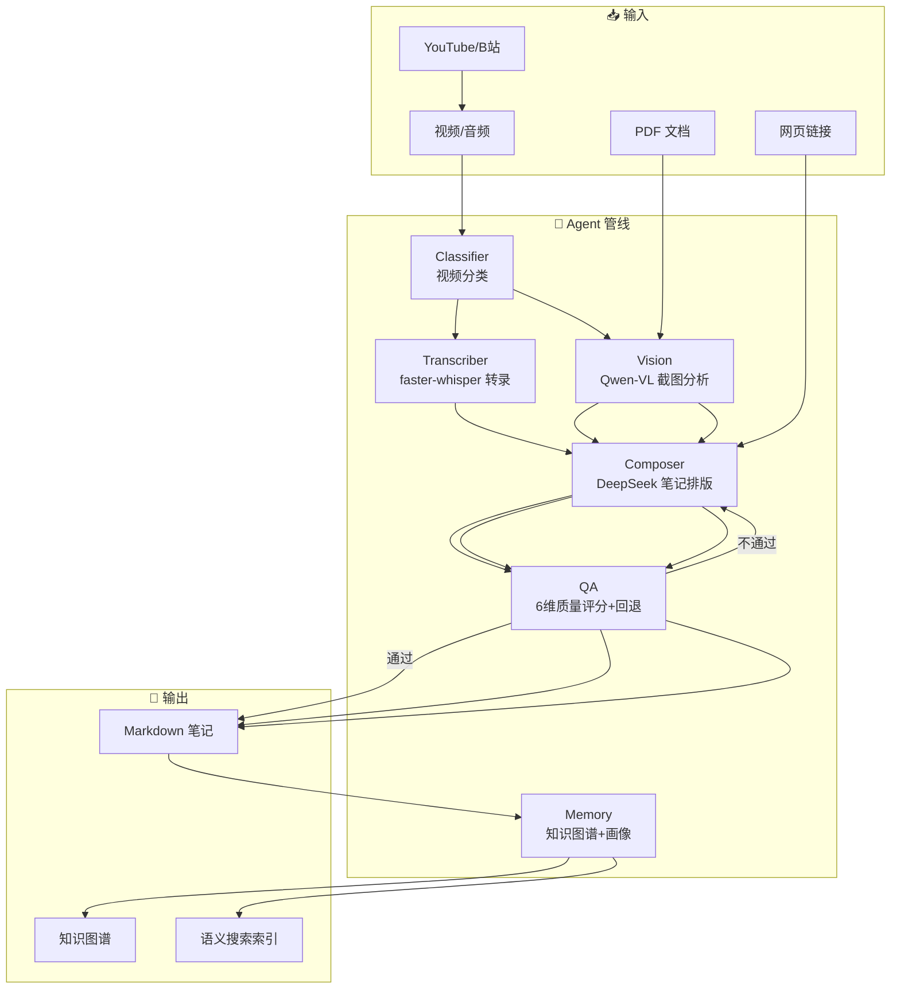

# NoteWeaver

> AI 笔记数字助理 — 视频 → 结构化笔记的 Agent 自动化管线

[](https://github.com/zhao78574/NoteWeaver/actions/workflows/test.yml)
[](https://www.python.org/)
[](LICENSE)

## 项目简介

NoteWeaver 是一个 AI 驱动的笔记数字助理，接收视频输入，自动完成**分类 → 转录 → 截图理解 → 排版 → 质检 → 归档**全流程，输出结构化笔记。

### 架构图



### 核心组件

| Agent | 职责 | 模型 |
|-------|------|------|
| **Classifier** | 视频分类 + 截图策略选择 | DeepSeek Chat |
| **Transcriber** | 语音识别（只跑一次） | faster-whisper |
| **Vision** | 截图语义理解 + 图注生成 | Qwen VL |
| **Composer** | 笔记排版生成 | DeepSeek Reasoner |
| **QA** | 6 维质量评分 + 递减阈值回退重排 | DeepSeek Reasoner |
| **Memory** | 三层记忆 + 知识图谱自维护 | DeepSeek Chat |

**三项能力**：
- **自动执行**：接收视频路径 → 全自动管线 → 笔记归档
- **记忆能力**：三层记忆 + 知识图谱自动提取 + 用户画像演化
- **决策能力**：QA 自检回退 + 自适应截图间隔 + 意图分类路由

## 功能特性

- 🎥 **全自动管线**：视频 → 转录 → 截图 → 排版 → 质检 → 归档，一步到位
- 🖼️ **PDF/网页处理**：直接输入论文 PDF 或网页链接，自动提取图文生成笔记
- 📥 **视频下载**：支持 YouTube / B站链接直接下载处理
- 🧠 **知识图谱**：自动提取概念关系，交互式可视化
- 🔍 **语义搜索**：离线 TF-IDF 语义搜索笔记库
- ⌨️ **快捷键支持**：任务运行中按 `Ctrl+C` 取消，返回提示符
- 📊 **自适应截图**：根据视频长度自动调整截图密度（30s~180s 间隔）
- ♻️ **QA 回退**：6 维质量评分 + 递减阈值自动重排

---

## 安装方法

### 环境要求

- **Python** ≥ 3.9（[python.org](https://www.python.org/downloads/) 或包管理器安装）
- **FFmpeg**（视频/音频提取）
- **Git**（克隆仓库）

### 安装步骤

以下全部在终端中执行。

#### ① 检查环境

```bash
# 检查 Python 版本
python --version
# 确认 ≥ 3.9，否则先安装 Python
```

#### ② 安装 FFmpeg

```bash
# Windows（使用 winget，Windows 11 自带）
winget install FFmpeg
# 若 winget 不可用，请从 https://ffmpeg.org/download.html 下载
# 并将 ffmpeg.exe 所在目录加入系统 PATH

# macOS（使用 Homebrew）
brew install ffmpeg

# Linux（Ubuntu/Debian）
sudo apt update && sudo apt install ffmpeg
```

```bash
# 验证安装
ffmpeg -version
```

#### ③ 克隆项目

```bash
git clone https://github.com/zhao78574/NoteWeaver.git
cd NoteWeaver
```


#### ④ 创建虚拟环境（推荐）

```bash
# 创建 venv（隔离项目依赖，避免与其他项目冲突）
python -m venv venv
```

```bash
# 激活虚拟环境
# Windows:
venv\Scripts\activate
# macOS / Linux:
source venv/bin/activate
```

激活后终端前缀会显示 `(venv)`。

#### ⑤ 升级 pip

```bash
python -m pip install --upgrade pip
```

#### ⑥ 安装 PyTorch（faster-whisper 依赖）

```bash
# CPU 版本（兼容性最好，推荐）：
pip install torch --index-url https://download.pytorch.org/whl/cpu

# 如有 NVIDIA GPU，安装 CUDA 版本以获得更快的转录速度：
# 请参考 https://pytorch.org 选择对应 CUDA 版本的安装命令
```

#### ⑦ 安装 NoteWeaver

```bash
pip install -e .
```

> `pyproject.toml` 已声明所有依赖，此命令会自动安装它们。
> 安装后 `weaver` 命令即可全局使用（在虚拟环境中）。

#### ⑧ 验证安装

```bash
# 查看版本号
weaver --version

# 查看帮助
weaver --help
```

---

## 快速开始

```bash
# 交互模式（推荐）
weaver

# 转录单个视频
weaver lecture.mp4

# 批量处理目录中所有视频
weaver --batch ./videos/

# 问答模式
weaver "PIE和TD PIE有什么区别？"
```

---

## 配置方法

### 获取 API Key

NoteWeaver 依赖两个 API：

| 服务 | 用途 | 获取地址 |
|------|------|---------|
| **DeepSeek** | 文本任务（分类/排版/质检/记忆） | https://platform.deepseek.com |
| **Qwen (DashScope)** | 视觉任务（截图分析） | https://dashscope.aliyuncs.com |

### 配置 API Key

支持 4 种方式，按优先级自动查找：

```bash
# 方式一：系统钥匙串（推荐 🔒 — API Key 不落盘）
pip install keyring
keyring set note_weaver DEEPSEEK_API_KEY
keyring set note_weaver QWEN_API_KEY

# 方式二：环境变量（适合 CI/容器）
export DEEPSEEK_API_KEY="sk-xxx"
export QWEN_API_KEY="sk-xxx"

# 方式三：.env 文件（开发环境备选）
cp .env.example .env
# 编辑 .env 填入你的 Key

# 方式四：全局配置文件（不推荐 — Key 明文存储在磁盘）
# 创建 ~/.note_weaver/config.json 并写入：
# {"api": {"deepseek": {"api_key": "sk-xxx"}, "qwen": {"api_key": "sk-xxx"}}}
```

### 网络代理（可选）

编辑 `note_weaver/config.yaml`，开启代理：

```yaml
proxy:
  enabled: true
  host: "127.0.0.1"
  port: 7890
```

---

## 使用示例

### 交互模式（推荐）

```bash
weaver
```

进入交互界面，支持：

| 操作 | 示例 |
|------|------|
| 问答 | 直接输入问题，如 `什么是PIE？` |
| 处理视频 | 输入视频路径，如 `lecture.mp4` |
| 处理 PDF | 输入 PDF 路径，如 `paper.pdf` |
| 处理网页 | 输入网页链接（非视频 URL） |
| 下载视频 | 输入 YouTube/B站 链接 |
| 批量处理合集 | 输入合集链接，拆分多批如 `1-10;11-18;19-25;26-36` |
| 重排笔记 | `重排 笔记名` |
| 删除笔记 | `删除 笔记名` 或 `删除"C:\path\note.md"` |
| 列出笔记 | `list` |
| 知识图谱 | `graph` |
| 取消任务 | 运行中按 `Ctrl+C` |
| 退出 | `/quit` |

### 单次问答

```bash
weaver "PIE和TD PIE有什么区别？"
```

### 处理单个视频

```bash
weaver lecture.mp4
```

### 处理 PDF

```bash
weaver paper.pdf
```

### 处理网页

```bash
weaver https://example.com/article
```

### 下载并处理视频

```bash
weaver https://www.youtube.com/watch?v=xxx
weaver https://www.bilibili.com/video/BVxxxx
```

### 批量处理

```bash
weaver --batch ./videos/
```

### 知识图谱

```bash
weaver --graph
```

### Web 界面

```bash
python note_weaver/web_ui.py
```

浏览器打开 Gradio 界面，支持聊天和视频上传。


---

## 示例输出

### 笔记预览

```markdown
# MOSFET 工作原理

## 1. 基本结构

MOSFET（Metal-Oxide-Semiconductor Field-Effect Transistor，
金属-氧化物-半导体场效应晶体管）是数字电路的核心器件。

**重点**：MOSFET 是一个**电压控制电流**的器件——
栅极电压控制源漏之间的电流。

### 四端结构

| 端子 | 全称 | 作用 |
|------|------|------|
| G | Gate 栅极 | 控制端 |
| S | Source 源极 | 载流子来源 |
| D | Drain 漏极 | 载流子流出 |
| B | Bulk 衬底 | 体区，通常接地 |

### 工作原理

当栅极加正电压 Vgs > Vth（阈值电压）时：
1. 栅极下面的 P 型衬底表面**反型** → 形成 N 型导电沟道
2. 源漏之间加 Vds → 电子从源极流向漏极 → 电流 Id

**容易搞混**：
- **增强型**：Vgs=0 时没有沟道，需要加电压才会导通
- **耗尽型**：Vgs=0 时已有沟道，需要加电压才会夹断
- CMOS 工艺用的是**增强型**！
```

### 视频处理流水

```text
输入: 45分钟教学视频 → Faster-Whisper 转录 → Qwen-VL 截图分析
                                          → DeepSeek 排版 → QA 质检 → 笔记归档
输出: data/Note/1.工艺速通/MOSFET_工作原理.md
```

### 合集合并（多批转笔记）

```bash
❯ 合集 https://www.bilibili.com/list/xxx
共 36 集

  范围? 1-10 / 1-10;11-18;19-25;26-36 多批
❯ 1-10;11-18;19-25;26-36

共 4 批，每批出一篇独立笔记:
  第1批: 1-10 (10集)
  第2批: 11-18 (8集)
  第3批: 19-25 (7集)
  第4批: 26-36 (11集)
```

---

## 目录结构

```
NoteWeaver/
├── note_weaver/              # 核心代码
│   ├── agent.py              #   🤖 NoteWeaverAgent 主类
│   ├── run.py                #   入口：CLI / 交互模式
│   ├── web_ui.py             #   Web 界面（Gradio）
│   ├── config.yaml           #   全局配置
│   ├── agents/               #   6 个子 Agent 实现
│   │   ├── orchestrator.py   #     中央调度
│   │   ├── classifier.py     #     视频分类
│   │   ├── transcriber.py    #     语音识别
│   │   ├── vision.py         #     截图理解
│   │   ├── composer.py       #     笔记排版
│   │   ├── qa.py             #     质量质检
│   │   └── memory_agent.py   #     记忆系统
│   ├── core/                 #   基础能力
│   │   ├── extractor.py      #     ffmpeg 视频/音频提取
│   │   └── state_machine.py  #     管线状态机
│   ├── memory/               #   记忆持久化
│   ├── skills/               #   搜索、问答等技能
│   │   ├── chat.py           #     对话交互
│   │   └── search.py         #     检索
│   └── utils/                #   工具
│       ├── config.py         #     配置加载
│       ├── logger.py         #     日志
│       └── prompts.py        #     Prompt 模板
├── data/                     # 运行时数据（已 gitignore）
│   ├── Note/                 #   笔记输出
│   ├── TXT/                  #   转录文本
│   └── memory_db/            #   记忆 + 知识图谱
├── logs/                     # 运行日志（已 gitignore）
├── .env.example              # 环境变量模板
├── .gitignore                # Git 忽略规则
├── pyproject.toml            # 项目配置
├── requirements.txt          # 依赖清单
└── LICENSE                   # 开源许可证
```

---

## 许可证

[GNU Affero General Public License v3.0](LICENSE)

Copyright (c) 2026 NoteWeaver (zhao78574)

**允许** ✅
- 学习、研究、个人使用
- 修改和分发（必须保留 AGPL-3.0 协议）
- 开源商用（必须开源全部修改）

**不允许** ❌
- 闭源商用（如需闭源商用，请联系作者获取商业授权）
  `Email: zhao78574@gmail.com`

---

## 国内用户加速

```bash
# 使用清华 PyPI 镜像加速 pip 安装
pip install -i https://pypi.tuna.tsinghua.edu.cn/simple torch --index-url https://download.pytorch.org/whl/cpu
pip install -i https://pypi.tuna.tsinghua.edu.cn/simple -e .

# 或全局配置镜像（一次配置，长期生效）
pip config set global.index-url https://pypi.tuna.tsinghua.edu.cn/simple
```
